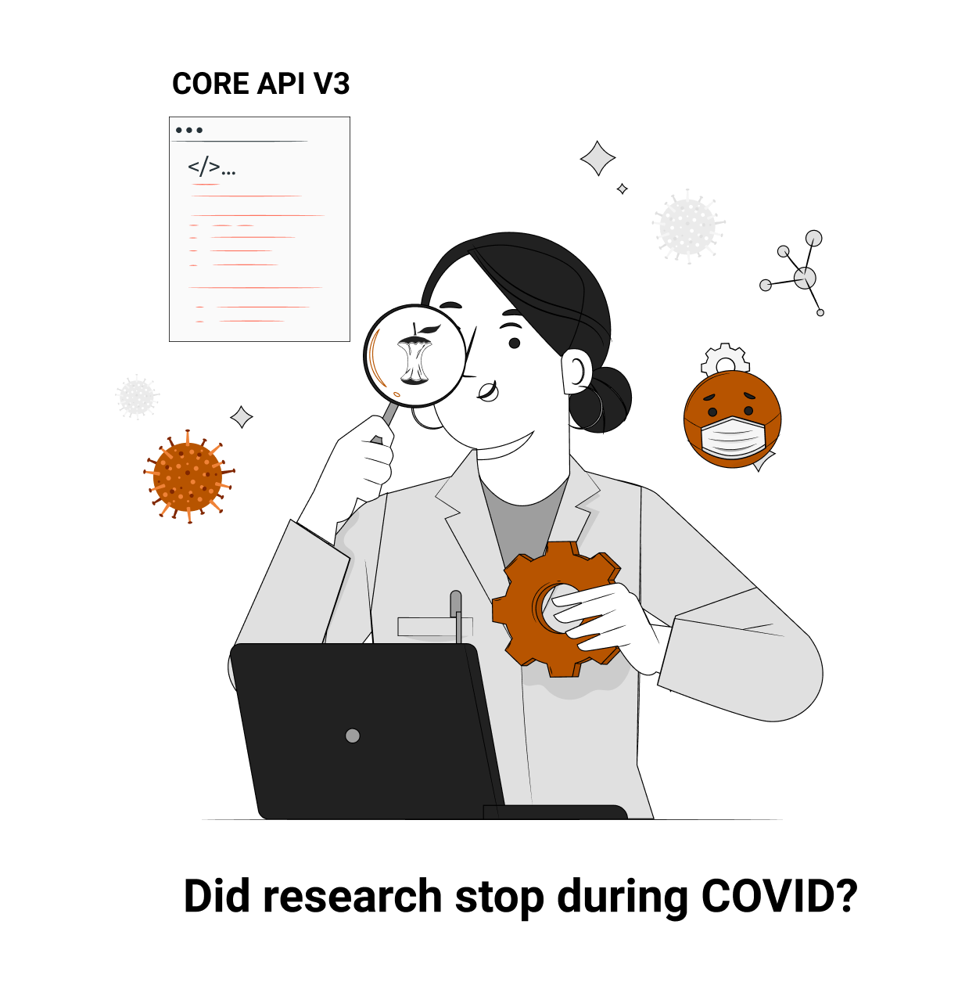

# apiv3-webinar
The code and the python Notebook used in the CORE webinar. 

In this notebook we show what you can do with the APIv3 and we try to answer the question "Did research stop during COVID?".

The code was part of a webinar "Access the world’s research outputs through the CORE API", [webinar recording](https://www.youtube.com/watch?v=acRLJNpq4W4) and [slides](https://www.slideshare.net/MatteoCancellieri1/access-the-worlds-research-outputs-through-the-core-api) are also available.

